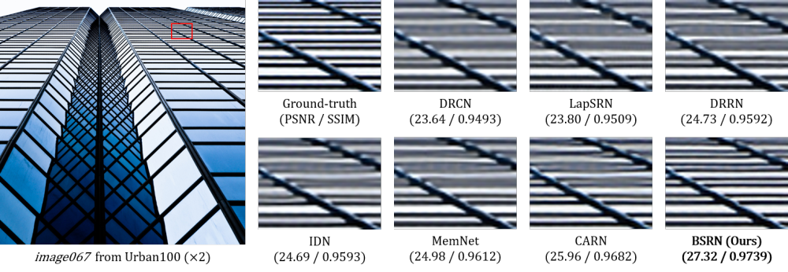

# Lightweight and Efficient Image Super-Resolution with Block State-based Recursive Network (BSRN)



This repository contains the official TensorFlow-based implementation of the BSRN model, which is explained in the following paper.
- J.-H. Choi, J.-H. Kim, M. Cheon, J.-S. Lee: Lightweight and efficient image super-resolution with block state-based recursive network. arXiv:18xx.xxxxx (2018) [arXiv]
```
@article{choi2018lightweight,
  title={Lightweight and efficient image super-resolution with block state-based recursive network},
  author={Choi, Jun-Ho and Kim, Jun-Hyuk and Cheon, Manri and Lee, Jong-Seok},
  journal={arXiv preprint arXiv:18xx.xxxxx},
  year={2018}
}
```

## Dependencies

- Python 3.6+
- TensorFlow 1.8+

## Training

The original BSRN model is trained with the DIV2K dataset.
You can download the images from its [official website](https://data.vision.ee.ethz.ch/cvl/DIV2K/).
After downloading and extracting the images, the directory structure may be looked like this:
```
/tmp/dataset/DIV2K/
|- DIV2K_train_LR_bicubic/
   |- X2/
      |- 0001x2.png
      |- 0002x2.png
      |- ...
   |- X3/
      |- 0001x3.png
      |- 0002x3.png
      |- ...
   |- X4/
      |- 0001x4.png
      |- 0002x4.png
      |- ...
|- DIV2K_train_HR/
   |- 0001.png
   |- 0002.png
   |- ...
```

Now you can train the model with the following command:
```
python train.py
  --dataloader=div2k_loader
  --data_input_path=/tmp/dataset/DIV2K/DIV2K_train_LR_bicubic
  --data_truth_path=/tmp/dataset/DIV2K/DIV2K_train_HR
  --train_path=/tmp/bsrn
  --model=bsrn
  --scales=2,3,4
  --bsrn_clip_norm=5
```
If your computer has sufficient amount of RAMs (e.g., more than 16GB), specify ```--data_cached``` to boost the training speed.

You can also change other parameters, e.g., batch size, the number of convolutional channels, and learning rate.
Please run ```python train.py --dataloader=div2k_loader --model=bsrn --helpfull``` for more information.

During the training, you can view the current training status via TensorBoard, e.g.,
```
tensorboard --logdir=/tmp/bsrn
```

You can also validate the trained model by ```validate_bsrn.py```.
For example, if you want to evaluate the model saved at step 50000 with the BSD100 dataset, run
```
python validate_bsrn.py
  --dataloader=basic_loader
  --data_input_path=/tmp/dataset/BSD100/LR
  --data_truth_path=/tmp/dataset/BSD100/HR
  --model=bsrn
  --scales=2,3,4
  --restore_path=/tmp/bsrn/model.ckpt-50000
  --save_path=/tmp/bsrn/results
```
It will print out the PSNR and RMSE values of the upscaled images with saving them on the path that you specified in ```--save_path```.
Please run `python validate_bsrn.py --model=bsrn --helpfull` for more information.

※ Note that the calculated PSNR and RMSE values may differ from the the values in our paper, due to the different calculation methods.
The code in this repository calculates PSNR and RMSE values from R, G, and B channels, while the measures reported in the paper were obtained from Y channel of the YCbCr color space.
